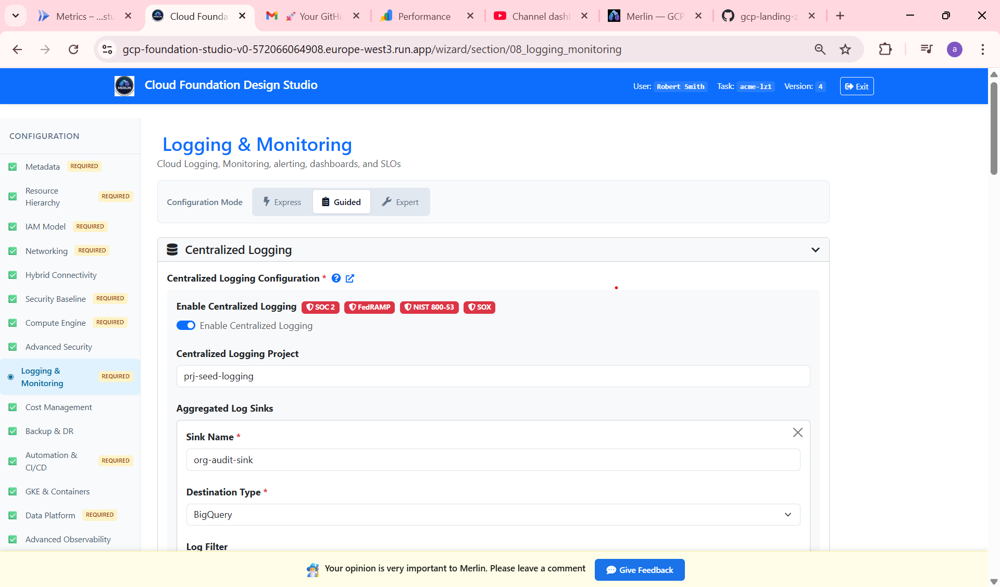
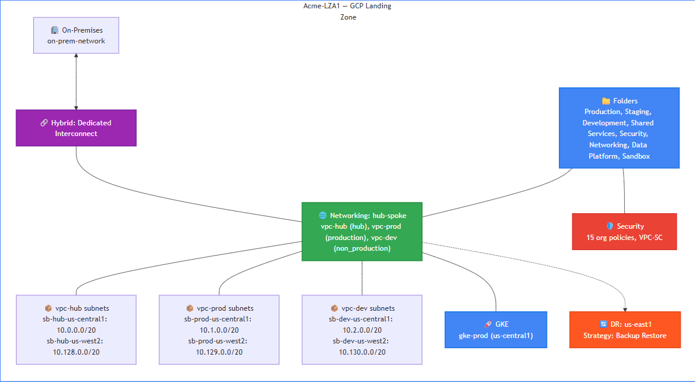
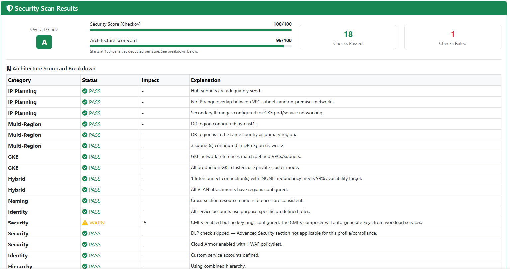

# What a FedRAMP-Ready GCP Landing Zone Actually Looks Like

---

## The Problem

You're building a GCP landing zone for a large organization under heavy regulatory pressure. It could be a government agency, a financial institution, a defense contractor — the specifics vary but the situation is identical. The security team has a list of requirements that grows every week. The CISO wants FedRAMP, NIST, SOC 2, and SOX — simultaneously. The CTO wants it live in weeks. Finance approved a budget that assumes everything goes smoothly. And your team is good, but they're not compliance lawyers.

This is not an unusual situation. It's the normal state of enterprise cloud adoption — competing pressures, incomplete knowledge, and a deadline that doesn't move.

Google Cloud Foundation Fabric (FAST) is the right foundation for this. The framework is well-engineered, actively maintained, and covers the full infrastructure stack. But FAST doesn't tell you what to put in it. When four compliance frameworks are stacked on top of each other, figuring out which org policies are required, what 7-year log retention means in practice, whether VPC Service Controls needs to enforce or just monitor — that's where teams get stuck for months.

This repository shows a complete working answer to those questions for a US government agency scenario. Here's what's in it and how it was built.

---

## The Scenario

The organization in this example is a mid-size US government agency contractor — 501 to 2,000 employees, a dedicated platform team of 21–50 engineers, and an existing Terraform practice. They run on GCP as their primary cloud with on-premises infrastructure connected via Dedicated Interconnect.

Their workload mix in this example is: GKE for containerized services, Cloud Run for APIs, Compute Engine for traditional workloads, and Dataflow for data pipelines. Data services include BigQuery, Firestore, Cloud Storage, and Pub/Sub — all handling regulated data.

Compliance requirements: FedRAMP Moderate, NIST 800-53, SOC 2, and SOX. Encryption must be customer-managed (CMEK). Data must stay within US boundaries. Audit logs must be retained for 7 years. The target availability is 99.9% with a warm DR strategy — primary in us-central1, recovery in us-east1.

This is the Advanced profile in Merlin — the configuration tier for organizations where compliance is not optional and every architectural decision has an audit implication.

---

## From Requirements to Configuration

Before any files are generated, Merlin runs the architect through a structured requirements wizard — but it's not a form. For every configuration field, Merlin already knows what the correct value should be based on your compliance requirements, and sets it as the default.



Look at the screenshot above. "Enable Centralized Logging" has four badges: SOC 2, FedRAMP, NIST 800-53, SOX. That means all four frameworks in this scenario require it. The toggle is already on. The architect doesn't research this — Merlin brings the compliance knowledge to the decision.

Every answer the architect reviews and confirms is recorded in `spec.json` — the file sitting in this repository. That file is the complete requirements record: what was needed, what was decided, and what Merlin generated from it. Three examples of how one field in spec.json becomes infrastructure:

**`compliance_requirements: [soc2, fedramp, nist, sox]`** — This single array is the root decision. Every subsequent default in the wizard flows from it. It triggers 15 org policies enforced at organization level, VPC Service Controls perimeter in enforcement mode, Assured Workloads with FEDRAMP_MODERATE regime, and 7-year audit log retention. A different compliance selection would produce a fundamentally different set of files.

**`encryption_requirements: cmek`** — One field. Merlin knows FedRAMP requires CMEK under NIST 800-53 SC-28, sets it as default, and generates KMS key rings for both regions (us-central1 and us-east1). CMEK is enabled across all 8 data services in the output: BigQuery, Cloud Storage, Cloud SQL, Firestore, Pub/Sub, GKE Secrets, Compute Disks, and Dataflow.

**`hybrid_connectivity: dedicated_interconnect`** — This generates a completely different networking directory than a VPN or internet-only design would produce. Cloud Router, Network Connectivity Center hub, VLAN attachment configuration — none of it appears unless the architect selects dedicated interconnect.

The full `spec.json` is in the repository. Every decision in the rest of this article traces back to a field in that file.

---

## What Was Generated


Merlin generated 82 files across 5 FAST stages. Each stage maps to a layer of the infrastructure stack.

The **org-setup** stage defines the folder hierarchy — 8 top-level folders, 4 environments, nested team sub-folders, and 15 organization policies enforced at the organization level. This is where compliance controls land first.

The **networking** stage configures a hub-and-spoke topology — 3 VPCs across 2 regions (us-central1 and us-west2), all subnets with Private Google Access and VPC Flow Logs enabled, connected to on-premises via Dedicated Interconnect through Network Connectivity Center.

The **security** stage covers KMS key rings for both regions, a DLP inspect template for PII detection, a Cloud Armor WAF policy, and the security project configuration.

The **project-factory** stage creates 16 workload projects — GKE, Data Platform, Application, and Ops projects across all 4 environments.

The **vpcsc** stage defines the VPC Service Controls perimeter, 3 access levels, and 5 ingress/egress policies.

All of this is in the repository. The rest of this article explains what it looks like and what to do with it.

---

## A Tour of the Repository Outputs

### Architecture Diagrams

Merlin generates a complete set of Mermaid architecture diagrams in `architecture.mmd` — renderable at [mermaid.live](https://mermaid.live) or directly in GitHub. The resource hierarchy diagram shows what compliance actually looks like in folder structure.



The 8 top-level folders are not arbitrary. Production, Staging, Development, and Sandbox are the 4 environments FedRAMP requires to be isolated from each other. Security, Networking, and Data Platform are separated into dedicated folders so IAM and org policies can be applied at the right scope — not everything needs to inherit the same controls. The team sub-folders under each environment exist because in a government contractor organization, different teams may operate under different access regimes within the same environment.

### Scorecards

After generation, Merlin validates the design and produces a combined scorecard — Checkov security scan plus architecture consistency checks.



This example scores Grade A: Checkov 100/100, Architecture 96/100. 18 checks passed, 1 failed. The single failure is a CMEK warning — key rings were auto-generated from workload services rather than explicitly declared, costing 5 architecture points. Everything else passes: no CIDR overlaps, GKE private cluster confirmed, all service accounts using least-privilege roles, 15 org policies enforced.

The scorecard is not a guarantee — it's a pre-flight check that catches mistakes before they become silent failures at `terraform apply` time.

### FAST YAML Files

The deployable output is 82 YAML files organized into 5 directories, each mapping to a FAST stage. This is not Terraform you write — it's configuration data that FAST modules consume.

A single example shows the pattern. This is one of the 15 org policies Merlin generated:

```yaml
# org-setup/datasets/main/organization/org-policies/gcp.resourcelocations.yaml
allowed_values:
  - in:us-locations
```

One file, one policy, one compliance requirement satisfied — FedRAMP data residency enforced at the organization level. Every resource creation outside US boundaries is blocked. The other 81 files follow the same principle: each file is a specific decision, traceable back to a field in `spec.json`.

You don't modify these files manually. You review them, verify the auto-resolved references flagged in `VALIDATION_WARNINGS.md`, replace placeholder values like billing account ID and organization ID — then copy them into your FAST stage directories and deploy.

### CMEK Wiring

`CMEK_WIRING.md` is a post-deployment instruction document. Merlin can generate the KMS key rings and enable CMEK on every data service — but it cannot complete the wiring automatically. Before any CMEK-encrypted service can function, the Google-managed service agent for that service must be granted `roles/cloudkms.cryptoKeyEncrypterDecrypter` on the relevant key. This binding happens outside the LZ creation process, at workload deployment time.

See [`CMEK_WIRING.md`](CMEK_WIRING.md) for the complete list of bindings required for this configuration — service by service, region by region. For a FedRAMP workload with 8 encrypted services across 2 regions, this is not something you want to reconstruct from memory when a deployment fails with an IAM error at 2am.

---

## Try It Yourself

Everything in this repository was generated in a single Merlin session. The `spec.json`, the 82 FAST files, the scorecards, the CMEK wiring doc — one wizard run for a government agency scenario with four stacked compliance frameworks.

If your scenario is different — different compliance requirements, different workload mix, different connectivity — the output will be different. That's the point.

The repository is open. Clone it, study it, deploy it as a reference. Or run your own requirements through Merlin at [merlinstudio.cloud](https://site.merlin-studio.cloud) and get a design built for your specific situation.

---

*Part of the [Merlin Studio](https://site.merlin-studio.cloud) GCP Landing Zone example series.*  
*See also: [Healthcare & PCI Example](https://github.com/Merlin-Studio/merlin-example-hipaa-standard) · [Startup Example](https://github.com/Merlin-Studio/merlin-example-startup-simple)*
